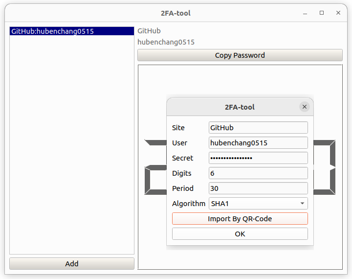

# 2FA-tool
two-factor authentication tool - 双因子认证工具



> Selecting item in list(including program start) will copy the password automatically.
> Needn't click the `Copy Password` button in spicially.
> 
> 选择列表选项(包括程序启动时)时会自动复制密码，不必特意点击 `Copy Password` 按钮。
> 

## Build

```
mkdir build
cd build
cmake ..
cmake --build .
```

## Reference

* [TOTP](https://en.wikipedia.org/wiki/Time-based_one-time_password)
* [HOTP](https://en.wikipedia.org/wiki/HMAC-based_one-time_password)
* [HMAC](https://en.wikipedia.org/wiki/HMAC)
* [RFC 4226](https://www.ietf.org/rfc/rfc4226.txt)